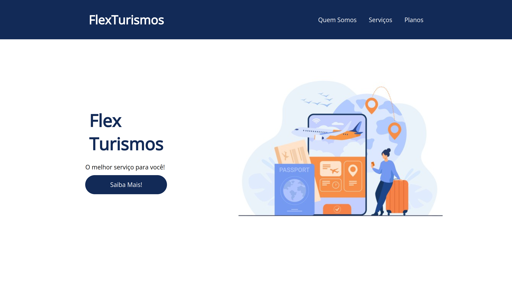

<h1 align="center"><a href="#" alt="site flexturismo"> FLEX-TURISMOS ✈️ </a></h1>

 <h4 align="center"> 🟢 Status do projeto:  Concluído ✔️   </h4>  

## 💻 Descrição do projeto 
 
A FlexTurismo é uma landing page criada como projeto final do curso posicionando elementos com flexbox em CSS da Digital Innovation One. 

O projeto é totalmente responsivo e foi criado usando as propriedade do Flexbox
  

 ## 🚀 Como acessar o projeto:
[Clique aqui para acessar](https://anafts.github.io/FlexTurismo-landing-page/)

 

## 🛠️ Tecnologias utilizadas:  

 

## 📚 Aprendizagem:
- FlexBox